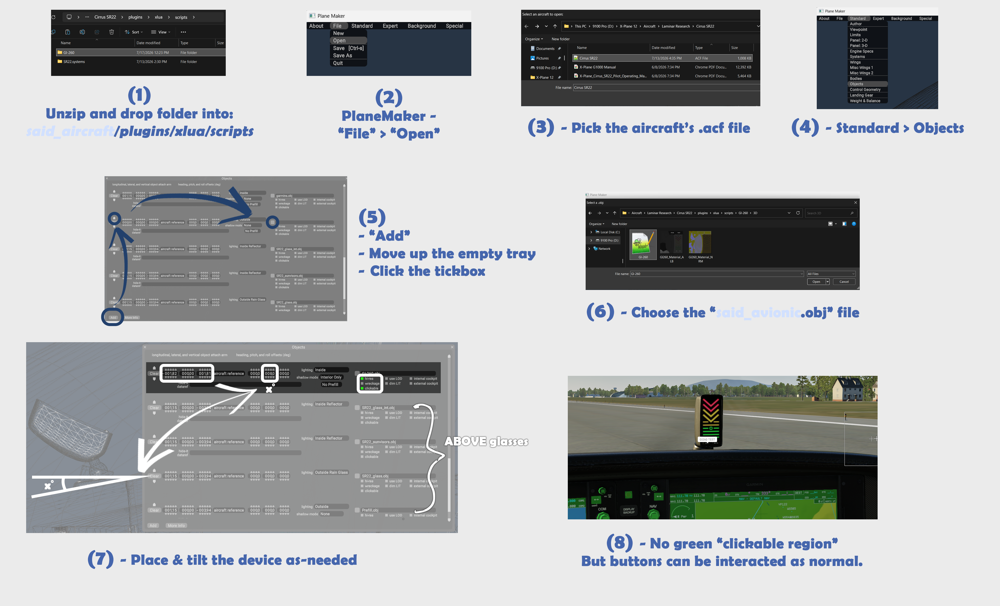

# Garmin GI 260 AOA for X-Plane

Garmin GI 260 AOA for X-Plane recreates the GI 260 angle-of-attack indicator as
both a simulator-wide XPLM popup plugin and an aircraft-local xLua 2.0 / Panel
Graphics instrument package.

The goal is not to draw a fixed-degree AOA ladder. The indicator uses X-Plane
aircraft data to approximate the real unit's calibrated lift-reserve behavior:
the green approach reference is derived from 1.3 x weight-adjusted Vso, the live
ladder is driven by normalized AOA/lift reserve, and stall-warning behavior is
respected near the red warning region.

## Project Variants

| Variant | Use Case | Audio | Rendering |
| --- | --- | --- | --- |
| XPLM plugin | Global drag-and-drop popup in `Resources/plugins` | Direct `Beep.wav` playback through X-Plane audio | XPLM drawn popup window |
| xLua 2.0 package | Aircraft-local 3D cockpit integration | No direct sound; exposes audio event datarefs for aircraft FMOD | XPLM Panel Graphics / `ATTR_cockpit_device` |

## Repository Contents

- `src/plugin.cpp` - native XPLM plugin implementation.
- `Textures/` - XPLM popup runtime PNG textures.
- `Resources/Beep.wav` - single-beep WAV used by the XPLM plugin.
- `config.ini` - XPLM plugin configuration template.
- `build/xlua_gi260/scripts/GI-260/` - xLua 2.0 aircraft-local GI260 package.
- `GI260-git-flowchart.png` - quick visual guide for xLua 2.0 aircraft integration.
- `CMakeLists.txt` - native plugin build and deploy configuration.

Generated binaries, local toolchains, rollback folders, private notes, PSD source
files, and the X-Plane SDK are intentionally not tracked.

## Feature Set

- Garmin GI 260-style 10-segment cumulative AOA ladder.
- Separate green Approach AOA Reference dot.
- Low-AOA approach behavior: green dot may illuminate with fewer than four green bars.
- Approach AOA behavior: green dot plus all four green bars.
- Yellow caution bars/chevrons above Approach AOA.
- Upper yellow chevron slow beep alert logic.
- Red Warning AOA fast beep alert logic.
- Lower red warning tied to stall-warning behavior; upper red acts as deeper warning/saturation.
- 50 KIAS arming latch. Before first arm, normal annunciation is suppressed without entering fail mode.
- Armed state remains latched through landing rollout until power/reset.
- Startup self-test sweep: bottom-to-top illumination, then rapid clear.
- TEST button logic, including all-on visual self-test.
- Unpowered TEST hold behavior: alternating red fail chevrons and quick beep event.
- Permanent fail mode with alternating red chevrons every 0.5 seconds.
- Startup/aircraft-load validation grace so transient zero datarefs do not immediately latch fail.
- Manual MUTE timer.
- Night background / LED dimming logic.
- Popup visibility can be configured at startup.
- Debug overlay in the XPLM plugin for calibration and troubleshooting.

## Simulation Logic

The real GI 260 is calibrated to an aircraft/configuration rather than showing
raw geometric degrees. This project follows that model as closely as practical
with public X-Plane datarefs.

Key data sources:

- IAS: `sim/cockpit2/gauges/indicators/airspeed_kts_pilot`
- Aircraft Vso: `sim/aircraft/view/acf_Vso`
- Stall warning alpha: `sim/aircraft/overflow/acf_stall_warn_alpha`
- Stall warning annunciator: `sim/cockpit2/annunciators/stall_warning`
- Stall warning ratio: `sim/cockpit2/annunciators/stall_warning_ratio`
- Empty mass: `sim/aircraft/weight/acf_m_empty`
- Max mass: `sim/aircraft/weight/acf_m_max`
- Fuel mass: `sim/flightmodel/weight/m_fuel_total`
- Payload/fixed mass: `sim/flightmodel/weight/m_fixed`
- Total mass: `sim/flightmodel/weight/m_total`
- Flap ratio: `sim/flightmodel/controls/flaprat`
- Weight-on-wheels: `sim/flightmodel/failures/onground_any` and `sim/flightmodel2/gear/on_ground`
- Aero normal force: `sim/flightmodel/forces/fnrml_aero`
- Gear normal force: `sim/flightmodel/forces/fnrml_gear`

The reference speed is computed from aircraft data:

```text
Vso_current = acf_Vso * sqrt(current_mass / max_mass)
Vref_target = 1.3 * Vso_current
```

The live display is not a simple IAS comparison. The ladder uses a normalized
speed/Vso lift-reserve proxy, stall-warning ratio, and ground lift support:

```text
speed_lift_ratio = (Vref_target / IAS)^2
```

On the ground, that proxy is attenuated by simulated aerodynamic support versus
gear load so takeoff roll and landing rollout do not behave like a pure speed
indicator. The stall-warning-ratio path can override the proxy near stall so the
red warning region respects X-Plane's own stall warning model.

Raw AOA datarefs are still read for debug visibility, but they are not the
primary LED driver because some aircraft report wrapped or wind-driven alpha
values while parked.

## Failure Conditions

The unit enters permanent fail mode only after the startup/load grace period and
repeated validation failures. Fail mode disables normal AOA logic and displays
alternating red chevrons.

Validation failures include:

- Missing IAS dataref.
- Invalid `acf_Vso`, including less than 5 kt or greater than 800 kt.
- Missing/invalid current mass or max mass.
- Impossible current/max weight ratio.
- Invalid weight-adjusted Vso.
- Missing or invalid `stall_warning_ratio`.
- Missing or invalid stall-warning alpha.
- Invalid approach alpha/reference relationship.
- Missing or impossible flap ratio.
- Missing weight-on-wheels/ground-state data.
- Missing or invalid aero/gear normal-force data required for the ground lift-support model.

Below 50 KIAS before arming is not a failure. It is simply unarmed/no normal
annunciation.

## Audio Behavior

### XPLM Plugin

The XPLM plugin loads:

```text
Garmin GI260 Popout/Resources/Beep.wav
```

The sample is a single beep and is replayed according to the current alert mode:

- Self-test pass/fail events: Beep event.
- Upper yellow chevron: slow Beep-Beep logic.
- Red warning annunciators: fast Beep-Beep logic.
- Fail mode: repeated fail beep event.

Audio is allowed only when powered, armed, not muted, and after both startup and
arming audio delays. Final audio gain is:

```text
config audio_gain * sim/operation/sound/radio_volume_ratio
```

### xLua 2.0 Package

xLua 2.0 integration does not play sound directly because an aircraft can only
own one FMOD main bank. Instead, it exposes datarefs for the aircraft author to
hook into their FMOD events:

```text
laminar/gi260/audio/beep_mode
laminar/gi260/audio/beep_gain
```

Suggested `beep_mode` usage:

- `0` - no beep request.
- `1` - event beep.
- `2` - slow upper-yellow alert.
- `3` - fast red-warning alert.
- `4` - fail alert.

## Night / NITS Logic

The native plugin uses `Background_LIT.png` as a nighttime overlay and applies
black masks over LED/button textures according to the configured night dataref.

The xLua 2.0 package uses Panel Graphics. Panel Graphics writes to X-Plane's
emissive layer; physical brightness is controlled by the NITS value in the OBJ
`ATTR_cockpit_device` line plus the avionics brightness callback. The current
GI260 OBJ uses a daylight-tuned NITS value, while night brightness is reduced
dynamically through:

- `sim/graphics/scenery/sun_pitch_degrees`
- `sim/cockpit2/electrical/instrument_brightness_ratio[0]`
- `panel_brightness_day`
- `panel_brightness_night`
- `night_led_black_mask_max`

The LED mask is applied only to the dynamic LED/arrow/bar/dot textures and does
not darken the painted 3D model background.

## Configuration

Most behavior can be adjusted without changing source code through `config.ini`.

Common configurable items:

- Power dataref.
- Night lighting / dimming datarefs.
- Startup popup status.
- Arming IAS.
- Audio startup and arming delays.
- Audio gain and beep repeat gaps.
- MUTE duration.
- Smoothing.
- Startup sweep timing.
- TEST duration.
- Aircraft fallback Vso/stall-alpha values.
- Approach speed multiplier.
- Ladder thresholds and hysteresis.
- xLua Panel Graphics brightness and LED alignment.

The XPLM plugin also provides an in-sim maintenance menu under Plugins:

- Toggle popup.
- Toggle border.
- Lock position.
- Debug overlay.

The xLua package exposes commands and datarefs that aircraft authors can bind to
custom panels, maintenance pages, or their own aircraft logic:

```text
laminar/gi260/popup_toggle
laminar/gi260/test
laminar/gi260/mute
laminar/gi260/button_L_press_CMD
laminar/gi260/button_R_press_CMD
laminar/gi260/xlua_loaded
laminar/gi260/xlua_heartbeat
laminar/gi260/popup_visible
laminar/gi260/unit_pitch_in_acf
```

`unit_pitch_in_acf` is read from the aircraft `.acf` object placement entry for
`GI-260.obj`, allowing the model animation to compensate for the device pitch
chosen in Plane Maker.

## Install: XPLM Popup Plugin

Build or download the native plugin package, then install it as:

```text
X-Plane 12/
  Resources/
    plugins/
      Garmin GI260 Popout/
        64/
          win.xpl
          mac.xpl
          lin.xpl
        Textures/
        Resources/
          Beep.wav
        config.ini
```

Only the platform binary for your operating system is required, but the final
package layout supports all three platform names.

Build locally with CMake:

```powershell
cmake -S . -B build -DXPLANE_SDK_DIR="<X-PlaneSDK>"
cmake --build build --config Release
```

Override the deployment root if desired:

```powershell
cmake -S . -B build -DXPLANE_PLUGIN_ROOT_DIR="<X-Plane 12>/Resources/plugins/Garmin GI260 Popout"
```

The XPLM popup remembers its configured startup visibility through
`initial_status` and can be controlled from the plugin menu.

## Install: xLua 2.0 Aircraft Integration

The xLua 2.0 version requires an X-Plane build that includes Panel Graphics and
the new xLua 2.0 API, such as X-Plane `12.4.4-pnl2` or any later/internal branch
that provides `XPLMPanelGraphics` and `ATTR_cockpit_device`.

It is not intended for legacy xLua 1.x aircraft.

Place the package inside the target aircraft:

```text
Your Aircraft/
  plugins/
    xlua/
      scripts/
        GI-260/
          GI-260.lua
          config.ini
          3D/
          Textures/
```

The target aircraft must also contain the xLua 2.0 plugin runtime and include
files required by the Panel Graphics preview build. If the aircraft already has
xLua 2.0, merge the `scripts/GI-260` folder without overwriting unrelated
aircraft scripts.

### Plane Maker Integration

Use Plane Maker to add the object:

1. Open the aircraft `.acf`.
2. Go to `Standard` > `Objects`.
3. Add a new object row near the end of the object list.
4. Select:

```text
../plugins/xlua/scripts/GI-260/3D/GI-260.obj
```

5. Place and pitch the device as needed.
6. Save the aircraft.



For current Panel Graphics preview builds, do not add GI260 commands to the
aircraft `*_vrconfig.txt`. The object contains its own button manipulators.
Some preview builds may show VRCONFIG warnings for unrelated stock aircraft
manipulators after adding a custom cockpit-device object; this appears to be an
X-Plane preview-build issue rather than a GI260 command issue.

## xLua Package Notes

- The 3D background is painted on the OBJ material.
- xLua draws only the dynamic LEDs, arrows, bars, dot, and pressed button states.
- The display uses one coordinate system derived from the full material atlas:

```text
panel_x = material_x / atlas_width * panel_width
panel_y = (1 - material_y / atlas_height) * panel_height
```

- Do not crop to the display UV island again. The OBJ UVs already define how the
  Panel Graphics framebuffer maps to the model.
- The button meshes contain OBJ manipulators and fire the `laminar/gi260`
  commands.
- In some preview builds the green clickable region may not display for this
  custom object, while the buttons still interact normally.

## Real-Unit Correspondence

The implementation is based around these GI 260 behavior points:

- The unit is a color-coded AOA/lift-reserve reference, not a raw degree gauge.
- The system arms above 50 KIAS.
- Approach AOA is calibrated to a published approach/threshold speed, typically
  1.3 x Vso.
- The green circle is an Approach AOA Reference, separate from the 10 ladder
  annunciators.
- Low AOA approach can show the green circle with fewer than four green bars.
- Approach AOA is green circle plus all four green bars.
- Yellow caution annunciators indicate AOA above Approach AOA.
- Upper yellow triggers slow audible alert logic.
- Red warning annunciators trigger fast audible alert logic.
- Self-test fail is alternating red chevrons.
- The lower red warning threshold is tied to stall-warning behavior.

Where X-Plane does not expose the exact physical pitot/AOA/static sensor model,
the plugin uses aircraft-authored V-speeds, mass, IAS, stall-warning ratio,
flap/ground state, and normal-force data to produce a calibrated simulation-side
equivalent.

## Known Limitations

- xLua 2.0 Panel Graphics support is tied to X-Plane preview/internal builds at
  the time of this work.
- xLua integration exposes audio event datarefs instead of playing sound.
- VRCONFIG integration is intentionally not part of the current package because
  preview builds can misreport unrelated aircraft manipulator errors when a
  custom cockpit-device object is attached.
- The native plugin has direct sound playback; the aircraft-local package leaves
  FMOD ownership to the aircraft author.

## License

See `LICENSE`.
